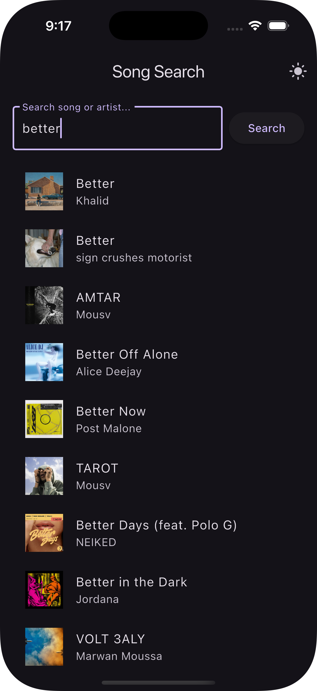
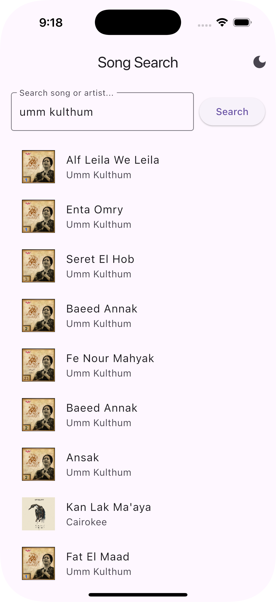
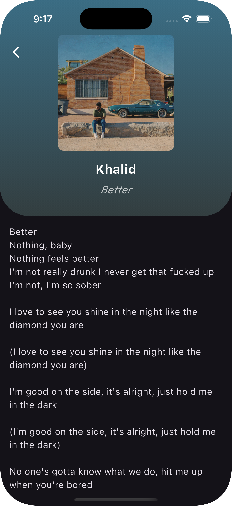
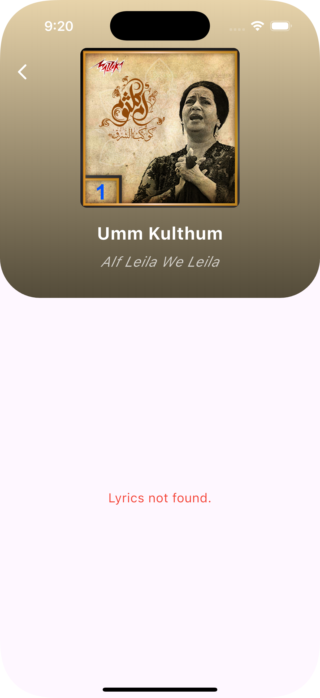

# Flutter Song Search & Lyrics App

This repository contains a **Flutter** application that lets you **search for songs** via the **Spotify Web API** and **display their lyrics** using the **Lyrics.ovh** API. Additionally, the app supports **Dark/Light Mode** toggling directly from the AppBar.

---

## Demo & Screenshots

<div align="center">
  
   

  
  
</div>

> **Note:** GitHub may not support inline playback for `.mp4` files; clicking the link will either download or open the video in your browser depending on GitHub’s handling and your browser settings.

---

## Table of Contents

1. [Features](#features)  
2. [Tech Stack](#tech-stack)  
3. [Project Structure](#project-structure)  
4. [Prerequisites](#prerequisites)  
5. [Setup Instructions](#setup-instructions)  
6. [Running the App](#running-the-app)  
7. [Usage Guide](#usage-guide)  
   - [Searching Tracks](#searching-tracks)  
   - [Viewing Lyrics](#viewing-lyrics)  
   - [Dark/Light Mode Toggling](#darklight-mode-toggling)  
8. [Troubleshooting](#troubleshooting)  
9. [Contributing](#contributing)  
10. [License](#license)

---

## Features

- **Search for songs** by keyword (song title, artist name).  
- **View track details** (title, artist name, album art) returned from Spotify.  
- **Fetch and display lyrics** from [Lyrics.ovh](https://lyricsovh.docs.apiary.io/).  
- **Dark/Light Mode** toggle button in the AppBar for quick theme switching.  
- **Auto-detect RTL** support (e.g., Arabic lyrics) for correct alignment.  
- **Colorful UI** thanks to the `palette_generator` for creating gradients from album art.

---

## Tech Stack

- **Flutter** (Dart) - UI/UX and app logic.  
- **Spotify Web API** - Searching for tracks.  
- **Lyrics.ovh** - Fetching lyrics.  
- **palette_generator** - Extracting color palettes from images.  
- **http** - Making network requests.  
- **flutter_dotenv** - Handling environment variables (Spotify credentials).

---

## Project Structure

```bash
lib/
 ┣ models/
 ┃  ┗ track.dart            # Data model for a track (title, artist, imageUrl)
 ┣ screens/
 ┃  ┣ home_screen.dart      # Main screen for searching + theme toggle
 ┃  ┗ detail_screen.dart    # Screen for displaying the selected track + lyrics
 ┣ services/
 ┃  ┣ spotify_service.dart  # Handles calls to Spotify (search)
 ┃  ┗ lyrics_service.dart   # Handles calls to Lyrics.ovh (lyrics fetching)
 ┣ widgets/
 ┃  ┣ search_bar.dart       # Custom search bar widget
 ┃  ┗ track_tile.dart       # Widget for rendering a track in a list
 ┗ main.dart                # Entry point of the Flutter app
```

---

## Prerequisites

1. **Flutter SDK** (v3.x or newer recommended).  
2. **Android Studio** or **Visual Studio Code** (optional, but recommended).  
3. **Spotify Developer Account** to obtain **Client ID** and **Client Secret** (for Spotify Web API).  
4. (Optional) **.env File** using [flutter_dotenv](https://pub.dev/packages/flutter_dotenv) for securely managing environment variables.

---

## Setup Instructions

1. **Clone the Repository**  
   ```bash
   git clone https://github.com/Hassan220022/LyriMate.git
   cd LyriMate
   ```
   > If your repository name is different, adjust `cd LyriMate` accordingly.

2. **Create/Update the `.env` File (Optional)**  
   In the project root, create a new `.env` file:
   ```dotenv
   SPOTIFY_CLIENT_ID=YOUR_SPOTIFY_CLIENT_ID
   SPOTIFY_CLIENT_SECRET=YOUR_SPOTIFY_CLIENT_SECRET
   ```
   Ensure `.env` is in your `.gitignore` to avoid committing secrets.

3. **Install Packages**  
   ```bash
   flutter pub get
   ```

4. **Configure SpotifyService**  
   - Open `lib/services/spotify_service.dart` and ensure your environment variables match or directly insert your client ID/secret.

---

## Running the App

1. **Connect a Device/Emulator**  
   Ensure you have at least one device available:
   ```bash
   flutter devices
   ```

2. **Run the App**  
   ```bash
   flutter run
   ```
   Or specify a particular device:
   ```bash
   flutter run -d <deviceId>
   ```
   Once the build completes, you’ll see the **Home Screen** on your device/emulator.

---

## Usage Guide

### Searching Tracks

1. In the **Home Screen**, type a **song title** or **artist name** in the search bar.  
2. Tap the **search icon** or press **Enter**.  
3. A list of track results from Spotify appears.

### Viewing Lyrics

1. Tap on any track to open the **Detail Screen**.  
2. The app requests lyrics from **Lyrics.ovh**.  
3. If found, they are displayed line-by-line in a scrollable area.  
   - RTL (e.g., Arabic) lyrics are automatically aligned Right-to-Left.  
4. If unavailable, you’ll see an error message (“Lyrics not found”).

### Dark/Light Mode Toggling

- In the **AppBar** on the Home Screen, click the **moon icon** (for dark mode) or **sun icon** (for light mode).  
- The theme applies to the entire app instantly.  
- This selection currently resets when the app is restarted (for persistence, you’d need local storage like `SharedPreferences`).

---

## Troubleshooting

- **No Results from Spotify**  
  - Check your `.env` file credentials.  
  - Ensure you’ve restarted after updating environment variables.
- **Lyrics Not Found**  
  - Lyrics.ovh may not have every track. Try a different query.  
- **Dark Mode Not Toggling**  
  - Ensure you have the latest `home_screen.dart` with the icon button in the AppBar.  
  - Verify your `_toggleTheme` method calls `MyApp.of(context)?.toggleTheme(...)`.  
- **Build or SDK Errors**  
  - Run `flutter pub get` again.  
  - Confirm your Flutter SDK is installed and up to date.

---

## Contributing

1. **Fork** this repository.  
2. **Create a feature branch** for your changes.  
3. **Commit** your changes.  
4. **Push** to your fork.  
5. **Submit a Pull Request** with a clear description of changes.

---

## License

This project is available under the [MIT License](LICENSE). You are free to modify and redistribute the code.

---